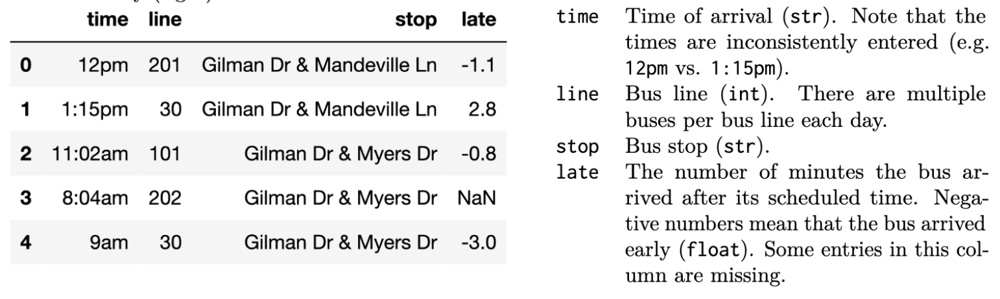
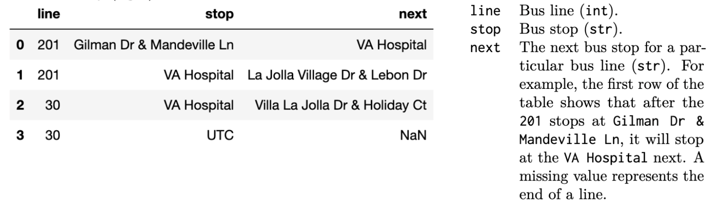

The `bus` table (left) records bus arrivals over $1$ day for all the bust stops within a $2$ mile radius of UCSD. The data dictionary (right) describes each column.

The `stop` table (left) contains information for al the bus lines in San Diego (not just the ones near UCSD). The data dictionary (right) describes each column.

