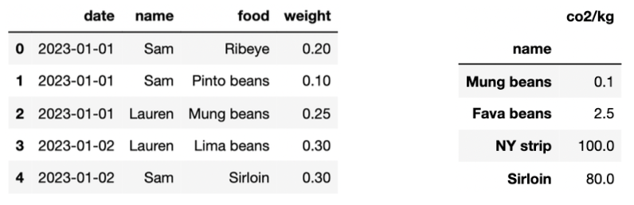

# BEGIN PROB
Fill in Python code below so that the last line of each part evaluates to each desired result, assuming that the following tables are both stored as `pandas` DataFrames. **You may not use `for` or `while` loops in any answer for this question. Only the first few rows are shown for each table.**

The `df` table (left) records what people ate in kilograms (kg) on each date in 2023. For example, the first row records that Sam ate 0.2 kg of Ribeye on Jan 1, 2023. The `foods` table (right) records the carbon dioxide (CO2) emissions it takes to produce each kind of food. For example, the first row in the `foods` table shows that growing 1 kg of mung beans produces 0.1 kg of CO2.

<center></center>

# BEGIN SUBPROB

Find the total kg of food eaten for each day and each person in `df` as a Series.

```py
df.groupby(____)[____].sum()
```

# BEGIN SOLN

**Answer**: `df.groupby(['date', 'name'])['weight'].sum()`

To satisfy "each day and each person", we need to group by both the `'date'` and `'name'` columns by passing them in as a list. Then to get "kg of food eaten", we must select the `'weight'` column with the second blank. The `sum()` method then will get the "total" amount as a Series (where you have `'date'` and `'name'` as indices and the sum as the value).
# END SOLN

# END SUBPROB

# BEGIN SUBPROB
Find all the rows in `df` where Tina was the person eating.

```py
df.____
```

# BEGIN SOLN
**Answer**: `df.loc[df['name'] == 'Tina']`

We can use the `loc` accessor to select the rows from `df` under a specific condition, where rows satisfying the condition as `True` will be selected. In this case, to get the rows where "Tina was the person eating", our conditional is when a value from the column `df['name']` is equal to the string `'Tina'`.
# END SOLN
# END SUBPROB
# BEGIN SUBPROB
Find all the unique people who **did not** eat any food containing the word "beans".
```py
def foo(x):
	return ____
	
df.groupby(____).____(foo)['name'].unique()
```
# BEGIN SOLN
**Answer**: 
```py
def foo(x):
	return x['food'].str.contains('beans').sum() == 0
	
df.groupby('name').filter(foo)['name'].unique()
```
To solve this, we start with the bottom line since without it we don't know what the argument `x` is in `foo(x)`. Since we want to find "the unique people", we will group by `'name'` to get to the per-individual level. Then, since we want to only keep the rows corresponding to certain groups, we can use the `filter` function. Since we pass `foo` into `filter`, we can now work on the `foo` function knowing `x` will be a group of `df` when aggregated by `'name'` (all the rows belonging to a single name).

To find people who ate food containing the word `'beans'`, we need to find the column of the food they ate: `x['food']`. Then we can recall that `pandas` has built-in string manipulation methods that can be used on every element of a Series by calling `.str.name_of_method()`. In this case, to find the string `'beans'` we will use `.str.contains('beans')`. At this point, we have a Boolean Series representing for one person, which meals they ate contained the word `'beans'` – an element in this Series is `True` if the corresponding meal contained `'beans'` and `False` otherwise.

We want to ensure that they didn't eat any `'beans'`, which would be true if all of the values in this Boolean Series are `False`, i.e. if the sum of the Boolean Series (since `True`s are counted as 1 and `False`s are counted as 0) is 0. This explains the `== 0` at the end.

The code then selects the `'name'` column and returns an array with its unique values, giving us the unique people who didn't eat any `'beans'`.

# END SOLN
# END SUBPROB

# BEGIN SUBPROB
Create a copy of `df` tht has one extra column called `'words` that contains the number of words for each value in the `'food'` column. Assume that words are separated by one space character. For example, "Pinto beans" has two words.
```py
def f(x):
	return ____

df.assign(____)
```
# BEGIN SOLN
**Answer**: 
```py
def f(x):
	return len(x.split())
	
df.assign(words = df['food'].apply(f))
```
Like the problem before, we need to start with the bottom line before working on `f(x)` so that we can determine what the parameter `x` represents. We are given the `assign` method, which we know will create a new column with format `assign(column_name=values)`. We are given that our new column name is `'words'`, so now we just need to get the values: the number of words for each value in the `'food'` column.

Knowing we have a helper function `f`, we can use the `apply` method on the `'food'` column `df['food']` to pass each value in food through `f`. Then, we can use `f` to calculate the number of words per value in `'food'`, where the input to `f` (that is, `x`) is a single value. Since we are given that words are separated by whitespace, we can just call `x.split()` to get a list with each word in its own index. The `len` of that list is therefore the count of words.

# END SOLN
# END SUBPROB

# BEGIN SUBPROB
Find the total kg of CO<sub>2</sub> produced by each person in `df`. If a food in `df` doesn't have a matching value in `foods`, assume that the food generates $100$ kg of CO<sub>2</sub> per kg of food.

```py
df2 = df.merge(foods, ____)
(df2.assign(____).groupby('name')['c'].sum()) 
```
# BEGIN SOLN
**Answer**: 
```py
df2 = df.merge(foods, left_on='food', right_index=True, how = 'left')
(df2.assign(c=df2['weight'] * df2['co2/kg'].fillna(100).groupby('name')['c'].sum()) 
```
To begin, we are merging `df` and `foods` as `df2`, but we need to figure out how. There are multiple ways to do this, so your answer might not match exactly what we have. We can see that the way to merge so we get the `'co2/kg'` for each food is to merge the `'food'` column of `df` with the index of `foods`. Since `df` is on the left, we pass in `left_on='food'`. Since `foods` is on the right and we are merging on the index not a column, we pass in `right_index=True` as well. Then, we are told "if a food doesn't have a matching value in `foods`, assume that the food generates $100$ kg of CO<sub>2</sub> per kg of food. This means we can't use the default inner join as this will drop non-matching values. Instead, we want to keep everything in the `df` table, so we say `how='left'` to do a left join.

Now that we have `df2` that has all the columns of `df` as well as a column of the `'co2/kg'` for each row, we can calculate the CO<sub>2</sub> production per person. We see that we are given code that groups the dataframe by person name, selects some column `'c'` that isn't in `df2` yet, and then sums the values. This seems to handle the **total** kg of CO<sub>2</sub> **per person** by calling and `groupby('name')` and the `.sum()` aggregation method. That tells us we need to make a new column in `df2` named `'c'`, representing the kg of CO<sub>2</sub> per meal/row. We are already given the `assign` method in the code, so we know that in that blank we need `c = [some Series containing CO2 weights]`. We have the `'weight'` and `'co2/kg'` columns in `df2`, so multiplying these would give us the end CO<sub>2</sub> for `'c'`. This looks like `df2['weight'] * df2['co2/kg']`.

Finally, we must recall that we are expected to handle the case where there is no matching value in the merge. Since we are doing a left join, we keep every value in `df` and might fill in some values of `foods` with `NaN` values. That means `df2['co2/kg']` needs to have `NaN` values replaced with `100`, and that can be done with `fillna(100)`. That makes our final solution `c=df2['weight'] * df2['co2/kg'].fillna(100)`.
# END SOLN
# END SUBPROB
# END PROB
