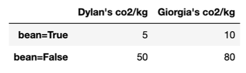

# BEGIN PROB
For this question, we'll continue using the `df` and `foods` tables form Question $1$. Dyaln and Giorgia want to compare their CO$_2$ emissions. They added a new column called `'bean'` to `df` that contains `True` if the food was a bean (e.g. "Pinto beans") and `False` otherwise. Then, they compute the following pivot table:

Each entry in the pivot table is the average CO$_2$ emissions for Dylan and Giorgia per kg of food they ate (CO$_2$/kg) for both bean and non-bean foods.

# BEGIN SUBPROB
Suppose that overall, Dylan produced an average of $41$ CO$_2$/kg of food he ate, while Giorgia produced an average of $38$ CO$_2$/kg. Determine whether each statement is definitely true (T), definitely false (F), or whether more information is needed (M) beyond this information and the pivot table above.

- A. This is an example of Simpson's paradox.  
- B. Dylan ate at least as many kg of bean foods compared to Giorgia.   
- C. Giorgia ate a higher proportion of bean foods than Dylan.  
- D. Dylan emitted more kg of CO$_2$ than Giorgia overall.  

# BEGIN SOLN

**Answer:**  

- A. T
- B. M
- C. T
- D. M

- A. Definitely True. Simpson's paradox is the case where grouped data and ungrouped data show different trends. In this case, the **ungrouped** data shown by the table – that is, when we look at CO$_2$/kg emissions **separately** for when when `'bean'` is `True` and when `'bean'` is `False` – give the appearance that Giogia's CO$_2$/kg is greater than Dylan's. However, the **grouped** data – that is, the **overall** data – tells us that Dylan's CO$_2$/kg is greater.
- B. More info needed. Since this problem only deals with the proportion of CO$_2$/kg, we cannot know anything about the actual kg amounts. $41$ CO$_2$/kg can be $41$ CO$_2$ in $1$ kg of eaten food, or $410$ CO$_2$ in $10$ kg of eaten food.
- C. Definitely True. This is definitely be true because we see that Giorgia's overall average CO$_2$/kg is lower than Dylan's, even though her separate amounts in both categories are greater. This is because both Dylan and Giorgia had different proportions of their food be made up of `'bean'` foods. In this case, since the case where `'bean'` is `True` produces less CO$_2$/kg, Giorgia must have a higher proportion of her food being `'bean'` foods in order to average out with a lower CO$_2$/kg than Dylan.
- D. More info needed. Similar to part B, we only know about the CO$_2$/kg proportion, and not the actual amounts. Even though Dylan has a higher average CO$_2$/kg output, if he ate less kg of food than Giorgia he may emit less kg of CO$_2$ overall.

# END SOLN
# END SUBPROB

# BEGIN SUBPROB

Dylan and Giorgia want to figure out exactly when Simpson's paradox occurs for their data. Suppose that $0.2$ proportion of Dylan's food was bean foods. What range of proportions for Giorgia's bean food would cause Simpson's paradox to occur?
Show your work in the space below, **then write your final answer in the blanks at the bottom of the page.** Your final answers should be between $0$ and $1$. Leave your answers as simplified fractions.

Between ____ and ____

# BEGIN SOLN

**Answer:** Between $\frac{39}{70}$ and $1$

First, we solve for the proportions that make the average overall CO$_2$/kg the same for Dylan and Giorgia as our threshold value. Since we are finding Giorgia's range of proportions, we will form our equation from her table column and set it equal to Dylan's average production:
$$
41 = 10B_{True} + 80B_{False}
$$
Where $B_{True}$ represents the proportion of foods that Giorgia eats that are `'bean'` (that is, Giorgia's `'bean'` is `True` proportion) and $B_{False}$ represents the proportion of foods that Giorgia eats that are not `'bean'` (that is, Giorgia's `'bean'` is `False` proportion).

We also know that these two must add to $1$, so:

$$
1 = B_{True} + B_{False} 
\\\implies B_{False} =  1 - B_{True}
$$

We can now plug this in to our first equation to get:

$$
41 = 10B_{True} + 80(1 - B_{True})
\\...
\\B_{True} =\frac{39}{70}
$$

Next we find whether Simpson's paradox occurs above or below this value where the two are equal. Since the ungrouped data shows Giorgia's CO$_2$/kg emissions are greater than Dylan's for both the case where `'bean'` is `True` (10 > 5) and where `'bean'` is `False` (80 > 10), we want to find the range of $B_{True}$ that results in an overall average that is **lower** than $41$. We can see that plugging in $B_{True}=1$ gives:
$$ 10(1) + 80(0) = 10$$

so our solution will be between $\frac{39}{70}$ and $1$. 
# END SOLN
# END SUBPROB

# END PROB
