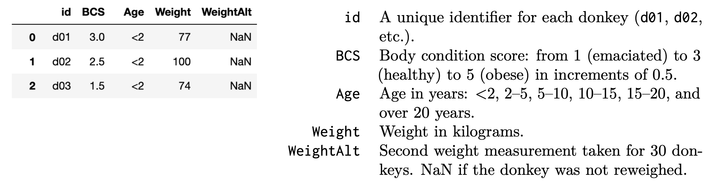

# BEGIN PROB
The `donkeys` table contains data from a research study about donkey health. The researchers measured the attributes of $544$ donkeys. The next day, they selected $30$ donkeys to reweigh. The first few rows of the `donkeys` table are shown below (left), and the table contains the following columns (right):

# BEGIN SUBPROB
What is the feature type of each column in `donkeys`? For each column below, answer discrete continuous, continuous, ordinal, or nominal.

- `'id'`: ____
- `'BCS'`: ____
- `'Age'`: ____
- `'Weight'`: ____
- `'WeightAlt'`: ____

# BEGIN SOLN

**Answer:**

- `'id'`: Nominal
- `'BCS'`: Ordinal
- `'Age'`: Ordinal
- `'Weight'`: Continuous
- `'WeightAlt'`: Continuous

Let's look one by one.

- `'id'`: Nominal. This is qualitative data. While each `'id'` has a number such as $01$ or $02$, these numbers are not ordered to signify any id is "greater" than another, and arithmetic doesn't make sense with them.
- `'BCS'`: Ordinal. This is qualitative data as `'BCS'` is an interpretive score representing "emaciated" to "obese". The data is ordered as it follows the scale mentioned prior.
- `'Age'`: Ordinal. This is qualitative data since the age is bucketed as "<2", "2-5", and so on. The data is ordered as "<2" is younger than "2-5", so this is also a scale of age.
- `'Weight'`: Continuous. This is quantitative since weight is a numeric measurement. It is continuous because there is no given restriction on the values the weight can take on.
- `'WeightAlt'`: Continuous. This is quantitative since weight is a numeric measurement. It is continuous because there is no given restriction on the values the weight can take on. Note that null values do not change the feature type of this variable.

Note that discrete continuous is not a real feature type!

# END SOLN
# END SUBPROB

# BEGIN SUBPROB
Consider the following scenarios for how the researchers chose the $30$ donkeys to reweigh. In each scenario, select if the missing mechanism for the `'WeightAlt'` column is NMAR, MAR, or MCAR.

*Note: Although the missing data are missing by design from the perspective of the original researchers, since we can't directly recover the missing values from our other data, we can treat the missing data as NMAR, MAR, or MCAR.*

- A. The researchers chose the $30$ donkeys with the largest `'Weight'` values to reweigh.
- B. The researchers drew $30$ donkeys uniformly at random without replacement from the donkeys with `'BCS` score of $4$ or greater.
- C. The researchers set `i` as a number drawn uniformly at random between $0$ and $514$, then reweighed the donkeys in `donkeys.iloc[i:i+30]`.
- D. The researchers reweighed all the donkeys, but deleted all the values in `'WeightAlt'` except for the $30$ lowest values.
- E. The researchers split up the donkeys into the 6 different age groups, then sampled $5$ donkeys uniformly at random without replacement within each age group.

# BEGIN SOLN

**Answer:**

- A. MAR
- B. MAR
- C. MCAR or MAR
- D. NMAR
- E. MCAR or MAR

Again, let's look one by one.

- A. Missing at random. This means missing values depend on another column in the DataFrame. In this case, the missing values of `'WeightAlt'` depend on the `'Weight'` column since we select the $30$ largest.
- B. Missing at random. This means missing values depend on another column in the DataFrame. In this case, the missing values of `'WeightAlt'` depend on the `'BCS'` column since we choose from those with a score of $4$ or greater.
- C. Missing completely at random or, possibly, Missing at Random. The argument for MAR is as follows: this means missing values depend on another column in the DataFrame. The missing values depend on the index since index $0$ can only be selected if `i = 0`, but index $29$ could be chosen if `i` is any value between $0$ and $29$, so it has a higher probability of being chosen. The original solution was MCAR as we did not account for edge case of `i` being small, but it is technically MAR. Credit was given for either answer.
- D. Not missing at random. This means missing values depend on the column they're missing from. The missing values here are all values that are not the $30$ lowest in `'Weight'`, and so they depend on the column itself.
- E. Missing completely at random or Missing at random. If the data was assumed to be evenly distributed, then the data is missing completely at random since the six age groups would all be chosen from uniformly. However, if the data was assumed to possibly have skewed age data, then samples from small sample size age groups had a higher probability of being chosen than those of large sample size age group. Credit was given for either answer.

# END SOLN
# END SUBPROB
# END PROB
