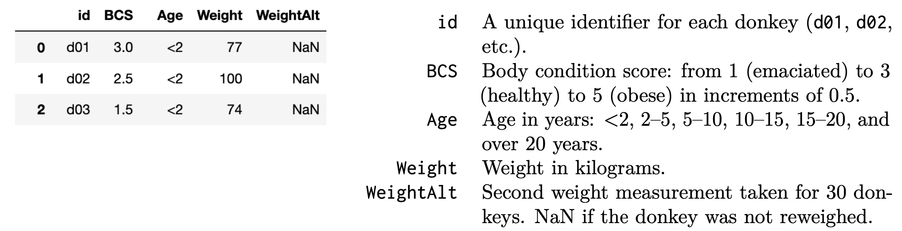
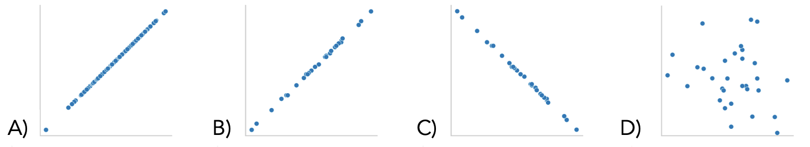

# BEGIN PROB
In this question, we will continue to work with the `donkeys` dataset from Problem $3$. The first few rows of the table column descriptions are shown again below for convenience.

<center></center>

For this question, assume that the researchers chose the $30$ donkeys to reweigh by drawing **a simple random sample of $30$ underweight donkeys: donkeys with BCS values of $1$, $1.5$, or $2$.** The researchers weighed these $30$ donkeys one day later and stored the results in the `'WeightAlt'`.

# BEGIN SUBPROB

Which of the following shows the scatter plot of `'WeightAlt' - 'Weight'` on the y-axis and `'Weight'` on the x-axis? Assume that missing values are not plotted.

<center></center>

# BEGIN SOLN
**Answer:** D

We are measuring the difference in weight from just one day on the y-axis, which means we can't expect any noticeable pattern of weight gain or loss no matter the original weight of the donkey. Therefore, a random scatterplot makes sense. Options A through C all suggest that the single-day weight change correlates with the starting weight, which is not a good assumption.

# END SOLN
# END SUBPROB

# BEGIN SUBPROB
Suppose we use mean imputation to fill in the missing values in `'WeightAlt'`. Select the scatter plot `'WeightAlt'` on `'Weight'` after imputation.

<center></center>

# BEGIN SOLN
**Answer:** A

Note we are now plotting `'Weight'` on the y-axis, not the difference of `'WeightAlt' - 'Weight'`. Therefore, it makes sense that we would have $30$ data points with a positive slope as the initial weight and re-weight are likely very similar. 

Then, mean imputation is the process of filling in missing values with the average of the non-missing values. Therefore, all missing values will be the same, and should be at the center of the sloped line since the line is roughly evenly distributed.

# END SOLN
# END SUBPROB

# BEGIN SUBPROB
Alan wants to see whether donkeys with `'BCS'` >= $3$ have larger `'Weight'` values on average compared to donkeys that have `'BCS'` < $3$. Select **all the possible test statistics** that Alan could use to conduct this hypothesis test. Let $\mu_1$ be the mean weight of donkeys with `'BCS'` >= $3$ and $\mu_2$ be the mean weight of donkeys with `'BCS'` < 3.

- A. $\mu_1$
- B. $\mu_1 - \mu_2$
- C. $2\mu_2-\mu_1$
- D. $|\mu_1-\mu_2|$
- E. Total variation distance
- F. Kolmogorov-Smirnov test statistic

# BEGIN SOLN
**Answer:** B and C

- A: Incorrect. $\mu_1$ does not tell compare the two groups, and so cannot be used to see which is larger on average.
- B: Correct. $\mu_1 - \mu_2$ tells us the difference between the average weight of both groups as well as which group would be larger (a test statistic greater than zero means $\mu_1$ is larger).
- C: Correct. $2\mu_2-\mu_1$ tells us the difference between the average weight of both groups as well as which group would be larger (a test statistic greater than $\mu_2$ means $\mu_2$ is larger).
- D: Incorrect. $|\mu_1-\mu_2|$ tells us the difference between the average weight of both groups, but we cannot tell which group is larger due to the absolute value sign.
- E: Incorrect. Total variation distance is defined as $\frac{1}{2}\sum^k_{i=1}|a_i-b_i|$. This has the same issue as D where we cannot tell which group is larger due to the absolute value sign.
- F: Incorrect. Kolmogorov-Smirnov is a measurement of the maximum absolute difference between two cumulative distribution functions. It does not look at the average, nor does it tell us which weight would be larger.

# END SOLN
# END SUBPROB

# BEGIN SUBPROB
To generate a single sample under his null hypothesis, Alan should:
- A. Resample $744$ donkeys with replacement from `donkeys`.
- B. Resample $372$ donkeys with replacement from `donkeys` with `'BCS'` < $3$, and another $372$ donkeys with `'BCS'` >= $3$.
- C. Randomly permute the `'Weight'` column.
# BEGIN SOLN
**Answer:** *C)*

The null hypothesis is "Donkeys with `'BCS'` >= $3$ have the **same** `'Weight'` values on average compared to donkeys that have `'BCS'` < $3$". Under the null hypothesis, we should have similar results with a shuffled dataset. Options A and B shuffle with replacement (bootstrapping), while option C shuffles without replacement (permutation is done without replacement). Bootstrapping is generally used to estimate confidence intervals, while permutation tests are a kind of hypothesis test. In this case, we are performing a hypothesis test, so we want to permute the `'Weight'` column.

# END SOLN
# END SUBPROB

# BEGIN SUBPROB
Doris wants to use multiple imputation to fill in the missing values in `'WeightAlt'`. She knows that `'WeightAlt'` is MAR conditional on `'BCS'` and `'Age'`, so she will perform multiple imputation conditional on `'BCS'` and `'Age'` - each missing value will be filled in with vlaues from a random `'WeightAlt'` value **from a donkey with the same `'BCS'` and `'Age'`.** Assume that all `'BCS'` and `'Age'` cmbinations have observed `WegihtAlt` values.
Fill in the blanks in the code below to estimate the median of `'WeightAlt'` using multiple imputation conditional on `'BCS'` and `'Age'` with $100$ repetitions. A function `impute` is also partially filled in for you, and you should use it in your answer.
```py
def impute(col):
	col = col.copy()
	n = ____
	fill = np.random.choice(____)
	col[____] = fill
	return col
results = []
for i in range(____):
	imputed = (donkeys.____(____)['WeightAlt'].____(____))
	results.append(imputed.median())
```
# BEGIN SOLN
**Answer:**
```py 
def impute(col):
	col = col.copy()
	n = col.isna().sum()
	fill = np.random.choice(col.dropna(), n)
	col[col.isna()] = fill
	return col
results = []
for i in range(100):
	imputed = (donkeys.groupby(['BCS', 'Age'])['WeightAlt'].transform(impute))
	results.append(imputed.median())
```
We start with the bottom five blanks as we are not sure what the parameter of `impute(col)` is until we write the function call first. We see that we are using a loop, and seeing that we are doing multiple imputation with $100$ reputations, we can fill in `range(100)`. We then define the variable `imputed`, which we can see from the last line of code that calls `imputed.median()` should be a list of `'WeightAlt'` that has imputed values. Since we want to make our imputation conditional on `'BCS'` and `'Age'`, we can fill in the next blank with a `groupby` method and pass in the list of columns we want - `['BCS', 'Age']`. We can see we have then selected the `'WeightAlt'` column in the problem, and so we need to use our `impute` function on that series. We can do so with a `transform` method and then pass in `impute`. Note this can also be done with `apply` and receive credit, but this is our solution.

Now, we can define the `impute` function to impute missing values from `col`. Since we have already aggregated on `['BCS', 'Age']`, we know that our given `col` has samples all of the same `'BCS'` and `'Age'` values. Therefore, to impute as defined in the question, we just need to fill in `NaN` values with any other value from `col`, chosen at random. We can see we will use `np.random.choice`, which takes in its first parameter possible choices in a list, and in its second parameter the number of choices to make. The number of choices to make we can define as `n`, which is the number of `NaN` values. This is found with `col.isna().sum()`. Then our possible choices are any non-`NaN` values in `col`, which we can use `col.dropna()` to find. Finally, we fill in the `NaN` values in `col` by masking for the `NaN` indices with `col[col.isna()]`, and set it equal to our `fill` values. That will successfully impute values into our `col` and we can then return it.
# END SOLN
# END SUBPROB
# END PROB
