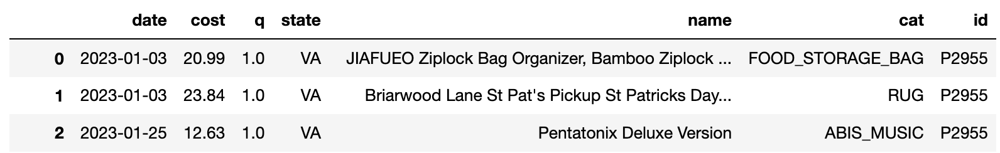
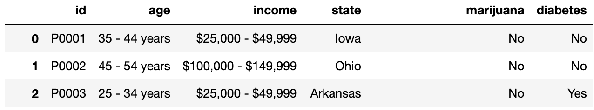

# BEGIN PROB

Fill in Python code below so that the last line of each code snippet evaluates to each desired result, using the `df` and `survey` DataFrames described on Page 1 of the Reference Sheet. **You may not use `for` or `while` loops in any answer for this question.** For convenience, the first few rows of `df` (top) and `survey` (bottom) are displayed below.

<center></center>

<center></center>


# BEGIN SUBPROB

Find the participant ID of the person who made the most recent purchase in the dataset.

```python
df.sort_values(__(a)__, ascending=True).iloc[__(c)__, __(b)__]
```

# BEGIN SOLN

**Answer:**

(a): `date`

(b): `-1`

(c): `-1`

# END SOLN

# END SUBPROB


# BEGIN SUBPROB

Create a DataFrame that compares the range of item costs for people with diabetes and people that don't have diabetes. The DataFrame should be indexed by the unique values in the `diabetes` column (Yes and No) and have one column: the range of item costs (max cost - min cost) for each group.

```python
def f(x):
    return __(a)__

(df.merge(survey, on='id')
   .groupby(__(b)__)[__(c)__]
   .__(d)__(f))
```

# BEGIN SOLN

**Answer:**

(a): `x.max() - x.min()`

(b): `'diabetes'`

(c): `'cost'`

(d): `agg`

# END SOLN

# END SUBPROB


# END PROB