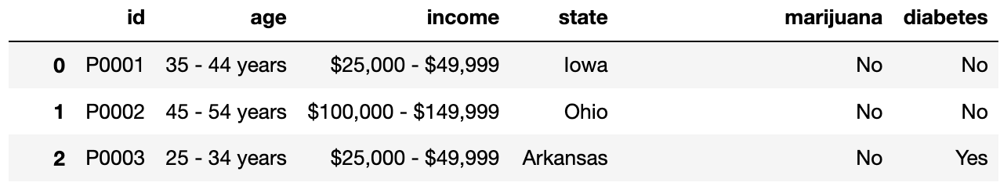

# BEGIN PROB

For each hypothesis test below, select the **one** correct procedure to simulate a single sample under the null hypothesis, and select the **one** test statistic that can be used for the hypothesis test among the choices given.

For convenience, the first few rows of `df` (top) and `survey` (bottom) are displayed below; see your Reference Sheet for the full details.

# BEGIN SUBPROB

Null: Every purchase is equally likely to happen in all 50 states.

Alternative: At least one state is more likely to have purchases than others.

**Simulation procedure:**

( ) `np.random.multinomial(len(df), [1/50] * 50)`  
( ) `np.random.multinomial(len(survey), [1/50] * 50)`  
( ) `np.random.multinomial(len(df), [1/2] * 2)`  
( ) `np.random.permutation(df['state'])`

**Test statistic:**

( ) Difference in means  
( ) Absolute difference in means  
( ) Total variation distance  
( ) K-S test statistic

# BEGIN SOLN

**Answer:**

Simulation procedure: `np.random.multinomial(len(df), [1/50] * 50)`

Test statistic: Total variation distance

# END SOLN

# END SUBPROB

# BEGIN SUBPROB

Null: The income distribution of people who smoke marijuana is the same as the income distribution for people who don't smoke marijuana.

Alternative: The income distributions are different.

**Simulation procedure:**

( ) `np.random.multinomial(len(survey), [1/50] * 50)`  
( ) `np.random.multinomial(len(survey), [1/2] * 2)`  
( ) `np.random.permutation(survey['income'])`

**Test statistic:**

( ) Difference in means  
( ) Absolute difference in means  
( ) Total variation distance  
( ) K-S test statistic

# BEGIN SOLN

**Answer:**

Simulation procedure: `np.random.permutation(survey['income'])`

Test statistic: Total variation distance

# END SOLN

# END SUBPROB

# BEGIN SUBPROB

Null: The distribution of prices for items with missing categories is the same as the distribution of prices for items with recorded categories.

Alternative: Items with missing categories are more expensive than items with with recorded categories.

**Simulation procedure:**

( ) `np.random.multinomial(len(df), [1/50] * 50)`  
( ) `np.random.multinomial(len(df), [1/2] * 2)`  
( ) `np.random.permutation(df['cost'])`

**Test statistic:**

( ) Difference in means  
( ) Absolute difference in means  
( ) Total variation distance  
( ) K-S test statistic

# BEGIN SOLN

**Answer:**

Simulation procedure: `np.random.permutation(df['cost'])`

Test statistic: Difference in means

# END SOLN

# END SUBPROB

# END PROB
