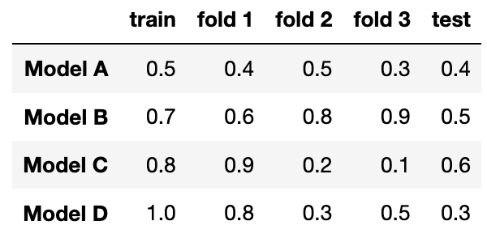

# BEGIN PROB

Suppose you fit four different models to predict whether someone has an income greater than \$100,000 a year using their purchase history. You split the data into a training and test set and use 3-fold cross-validation. The table below shows all the calculated accuracies for each model (higher accuracy is better).

# BEGIN SUBPROB

Which model has the lowest model bias?

( ) Model A  
( ) Model B  
( ) Model C  
( ) Model D

# BEGIN SOLN

**Answer:** Model D

# END SOLN

# END SUBPROB

# BEGIN SUBPROB

Which model most severely underfits the data?

( ) Model A  
( ) Model B  
( ) Model C  
( ) Model D

# BEGIN SOLN

**Answer:**  Model A

# END SOLN

# END SUBPROB

# BEGIN SUBPROB

Which model most severely overfits the data?

( ) Model A  
( ) Model B  
( ) Model C  
( ) Model D

# BEGIN SOLN

**Answer:** Model D

# END SOLN

# END SUBPROB

# BEGIN SUBPROB

Which model should you pick overall?

( ) Model A  
( ) Model B  
( ) Model C  
( ) Model D

# BEGIN SOLN

**Answer:** Model B

# END SOLN

# END SUBPROB

# END PROB