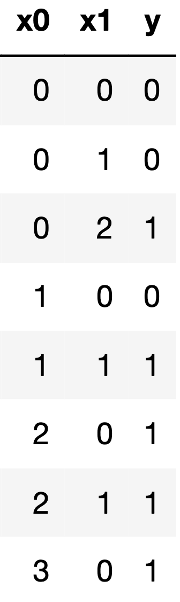

# BEGIN PROB

Suppose you fit a decision tree to the training set below, using the features `x0` and `x1` to predict the outcome `y`.

Write the first four splitting rules that are created by the decision tree when fitting this training set (using weighted entropy). Assume that the tree is constructed in a depth-first order. If two candidate splits have the same weighted entropy, choose the one that splits on `x0`.

# BEGIN SUBPROB

The first splitting rule is: `___(i)___ <= ___(ii)___`

(i):

( ) `x0`
( ) `x1`

(ii):

( ) `0`
( ) `1`
( ) `2`
( ) `3`

# BEGIN SOLN

**Answer:**

(i): `x0`

(ii): `1`

# END SOLN

# END SUBPROB

# BEGIN SUBPROB

The second splitting rule is: `___(i)___ <= ___(ii)___`

(i):

( ) `x0`
( ) `x1`

(ii):

( ) `0`
( ) `1`
( ) `2`
( ) `3`

# BEGIN SOLN

**Answer:**

(i): `x1`

(ii): `0`

# END SOLN

# END SUBPROB

# BEGIN SUBPROB

The third splitting rule is: `___(i)___ <= ___(ii)___`

(i):

( ) `x0`
( ) `x1`

(ii):

( ) `0`
( ) `1`
( ) `2`
( ) `3`

# BEGIN SOLN

**Answer:**

(i): `x0`

(ii): `0`

# END SOLN

# END SUBPROB

# BEGIN SUBPROB

The fourth splitting rule is: `___(i)___ <= ___(ii)___`

(i):

( ) `x0`
( ) `x1`

(ii):

( ) `0`
( ) `1`
( ) `2`
( ) `3`

# BEGIN SOLN

**Answer:**

(i): `x1`

(ii): `1`

Here is a plot of the training data:

Here is a plot of the fitted tree (from scikit-learn):

# END SOLN

# END SUBPROB

# END PROB
