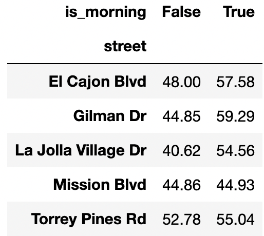
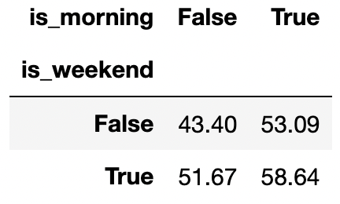

# BEGIN PROB

# BEGIN SUBPROB

Consider the following pivot table created using the `df` table from Question~\ref{q:pivoting} which shows the average duration of power outages split by street name and whether the outage happened before 12pm.

Given only the information in this pivot table and the Reference Sheet, is it possible to observe Simpson's paradox for this data if we don't split by street? In other words, is it possible that the average duration of power outages before 12pm is lower than the average duration of power outages after 12pm?

( ) Yes
( ) No
( ) Need more information to determine

# BEGIN SOLN

**Answer:** Yes

Notice that the overall average of the durations when `is_morning=True` is a weighted average of the values in the `is_morning=True` column of the pivot table. This means that the overall average when `is_morning=True` must be between (44.93, 59.29). Likewise, the overall average when `is_morning=False` must be between (40.62, 52.78). This implies that it's possible for Simpson's paradox to happen, since the overall average when `is_morning=False` can be higher than the average when `is_morning=True`.

# END SOLN

# END SUBPROB

# BEGIN SUBPROB

Consider the following pivot table created using the `o` table, which shows the average duration of power outages split by whether the outage happened on the weekend and whether the outage happened before 12pm.

Given only the information in this pivot table and the Reference Sheet, is it possible to observe Simpson's paradox for this data if we don't split by `is_weekend`? In other words, is it possible that the average duration of power outages before 12pm is lower than the average duration of power outages after 12pm?

( ) Yes
( ) No
( ) Need more information to determine

# BEGIN SOLN

**Answer:** No

By the same logic as the previous part, the overall average when `is_morning=True` must be between (53.09, 58.64). The overall average when `is_morning=False` must be between (43.40, 51.67). This implies that Simpson's paradox cannot happen, since the overall average when `is_morning=False` will never be greater than the overall average when `is_morning=True`.

# END SOLN

# END SUBPROB

# END PROB