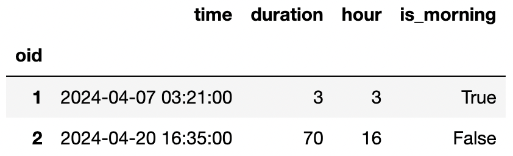

# BEGIN PROB

Praveen wants to answer the following questions using hypothesis tests on the power outages data, so he adds a `hour` and `is_morning` column to the `o` DataFrame. The first few rows of the new `o` DataFrame are shown below. For this problem, assume that some of the `duration` values are missing.

For each test, select the **one** correct procedure to simulate a single sample under the null hypothesis, and select **all** test statistics that can be used for the hypothesis test among the choices given.

# BEGIN SUBPROB

Null Hypothesis: Every hour of the day (0, 1, 2, etc.) has an equal probability of having a power outage.

Alternative Hypothesis: At least one hour is more prone to outages than others.

**Simulation procedure**:

( ) `np.random.multinomial(100, [1/2] * 2)`  
( ) `np.random.multinomial(100, [1/24] * 24)`  
( ) `o['hour'].sample(100)`  
( ) `np.random.permutation(o['duration'])`

**Test statistic**:

[ ] Difference in means  
[ ] Absolute difference in means  
[ ] Total variation distance  
[ ] K-S test statistic

# BEGIN SOLN

**Answer:** 

Simulation procedure: `np.random.multinomial(100, [1/24] * 24)`

Test statistic: Total variation distance, K-S test statistic

# END SOLN

# END SUBPROB

# BEGIN SUBPROB

Null: The proportion of outages that happen in the morning is the same for both recorded durations and missing durations.

Alternative: The outages are more likely to happen in the morning for missing durations than for recorded durations.

**Simulation procedure**:

( ) `np.random.multinomial(100, [1/2] * 2)`  
( ) `np.random.multinomial(100, [1/24] * 24)`  
( ) `o['hour'].sample(100)`  
( ) `np.random.permutation(o['duration'])`

**Test statistic**:

[ ] Difference in means  
[ ] Absolute difference in means  
[ ] Total variation distance  
[ ] K-S test statistic

# BEGIN SOLN

**Answer:** 

Simulation procedure: `np.random.permutation(o['duration'])`

Test statistic: Difference in means

# END SOLN

# END SUBPROB

# BEGIN SUBPROB

Null: The distribution of hours is the same for both recorded durations and missing durations.

Alternative: The distribution of hours is different for recorded durations and missing durations.

**Simulation procedure**:

( ) `np.random.multinomial(100, [1/2] * 2)`  
( ) `np.random.multinomial(100, [1/24] * 24)`  
( ) `o['hour'].sample(100)`  
( ) `np.random.permutation(o['duration'])`

**Test statistic**:

[ ] Difference in means  
[ ] Absolute difference in means  
[ ] Total variation distance  
[ ] K-S test statistic

# BEGIN SOLN

**Answer:** 

Simulation procedure: `np.random.permutation(o['duration'])`

Test statistic: Absolute difference in means, Total variation distance, K-S test statistic

# END SOLN

# END SUBPROB

# END PROB