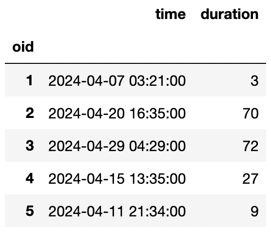

The `h` table records addresses within San Diego. Only 50 addresses are recorded. The index of the dataframe contains the numbers 1-50 as unique integers.

- `"number" (int)`: Street address number
- `"street" (str)`: Street name

The `o` table records information on power outages within San Diego in April 2024. Only 100 outages are recorded. The index of the dataframe contains the numbers 1-100 as unique integers.

- `"time" (pd.Timestamp)`: When the outage began
- `"duration" (int)`: How long the outage lasted in minutes

The `j` table is a table that links outages to addresses. Each entry in the `j` table contains the `hid` of the affected address and the `oid` of the outage. For example, the first row of the table records that the outage with an `oid` of 1 caused the power to go out at addresses with `hid` 61 and 88. A single outage can affect multiple addresses. There are no missing values and no duplicated rows in this table, and all values are positive integers. This table records all the addresses affected by all of the outages in 2024 so far.

- `"hid" (int)`: The `hid` of the affected address
- `"oid" (int)`: The `oid` of the outage

