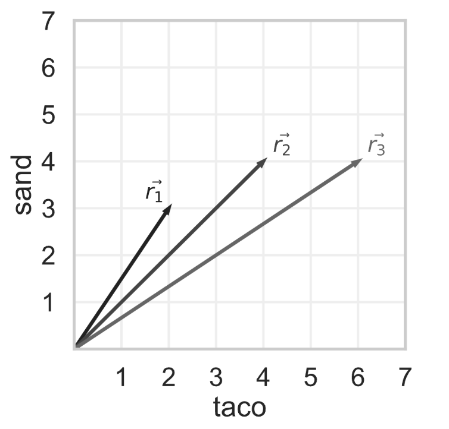

# BEGIN PROB

Tiffany decides to look at reviews for the same hotel, but she modifies them so that the only terms they contain are `"taco"` and `"sand"`. The bag-of-words representations of three reviews are shown as vectors below.

Using cosine similarity to measure similarity, which pair of reviews are the most similar? If there are multiple pairs of reviews that are most similar, select them all.

[ ] $\vec{r}_1$ and $\vec{r}_2$
[ ] $\vec{r}_1$ and $\vec{r}_3$
[ ] $\vec{r}_2$ and $\vec{r}_3$

# BEGIN SOLUTION

**Answer:** $\vec{r}_1$ and $\vec{r}_2$, **and** $\vec{r}_2$ and $\vec{r}_3$

The cosine similarity of two vectors $\vec{a}$ and $\vec{b}$ is $\frac{\vec{a} \cdot \vec{b}}{||\vec{a}|| \cdot ||\vec{b}||}$.

The cosine similarity of $\vec{r}_1$ and $\vec{r}_2$ is:

$$\frac{2 \cdot 4 + 3 \cdot 4}{\sqrt{13} \cdot \sqrt{32}} = \frac{20}{4 \cdot \sqrt{26}} = \frac{5}{\sqrt{26}}$$

The cosine similarity of $\vec{r}_1$ and $\vec{r}_3$ is:

$$\frac{2 \cdot 6 + 3 \cdot 4}{\sqrt{13} \cdot \sqrt{52}} = \frac{24}{26} = \frac{12}{13}$$

The cosine similarity of $\vec{r}_2$ and $\vec{r}_3$ is:

$$\frac{4 \cdot 6 + 4 \cdot 4}{\sqrt{32} \cdot \sqrt{52}} = \frac{40}{8 \cdot \sqrt{26}} = \frac{5}{\sqrt{26}}$$

$\frac{12}{13} \approx 0.9231$, and $\frac{5}{\sqrt{26}} \approx 0.9806$, so our answer is vector pairs $\vec{r}_1$ and $\vec{r}_2$, and $\vec{r}_2$ and $\vec{r}_3$

<average>74</average>

# END SOLUTION

# END PROB