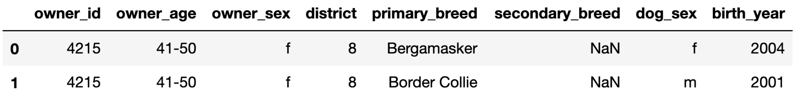

# BEGIN PROB

The DataFrame `observed_counts`, shown in its entirety below, describes
the number of dogs with each combination of owner sex and dog sex in
`dogs`.

<center></center>

For instance, there are 2300 dogs that are female and have a male owner.

# BEGIN SUBPROB

Consider the following two hypotheses.
-   **Null Hypothesis**: The distribution of dog sex for female owners is
    equal to the distribution of dog sex for male owners.
-   **Alternative Hypothesis**: The distribution of dog sex for female
    owners is not equal to the distribution of dog sex for male owners.

Suppose `counts` is a DataFrame with the same format as
`observed_counts` containing a simulated sample drawn under the null
hypothesis.

```py
col_norm = counts / counts.sum()
stat1 = col_norm.diff().abs().iloc[1, 0]
stat2 = col_norm.diff(axis=1).abs().iloc[0, 1]
stat3 = col_norm.diff(axis=1).abs().iloc[:, 1].sum() / 2

row_norm = counts.apply(lambda s: s / s.sum(), axis=1)
stat4 = row_norm.diff().abs().iloc[1, 0]
stat5 = row_norm.diff(axis=1).abs().iloc[0, 1]
stat6 = row_norm.diff(axis=1).abs().iloc[:, 1].sum() / 2
```

Which of the variables defined above are valid test statistics for these
two hypotheses? Select all that apply.

[ ] `stat1`
[ ] `stat2`
[ ] `stat3`
[ ] `stat4`
[ ] `stat5`
[ ] `stat6`

# BEGIN SOLUTION

**Answer**: `stat4` only

Note that here, we're comparing the **rows** of `counts`. To turn each row into a valid distribution that sums to 1, we need to divide each row by the sum of itself. That means that none of `stat1`, `stat2`, nor `stat3` work for these two hypotheses, since these three statistics have columns that add to 1, not rows.

`stat4` is the option that works for these two hypotheses. It normalizes the rows so that they sum to 1, and then finds the absolute difference in proportions between the proportion of female dogs in both groups. Remember that when there are only two categories, the TVD is equal to the absolute difference in proportions for one of the categories!

`stat5` doesn't work because it tries to subtract elements in the same distribution from one another, whereas the goal is to compare the corresponding proportions in different distributions.

<average>63</average>

# END SOLUTION

# END SUBPROB

# BEGIN SUBPROB

Now, consider the following two hypotheses.

-   **Null Hypothesis**: The distribution of owner sex for female dogs is
    equal to the distribution of owner sex for male dogs.
-   **Alternative Hypothesis**: The distribution of owner sex for female
    dogs is not equal to the distribution of owner sex for male dogs.

Which of the variables from part (a) above are valid test statistics for
these two hypotheses? Select all that apply.

[ ] `stat1`
[ ] `stat2`
[ ] `stat3`
[ ] `stat4`
[ ] `stat5`
[ ] `stat6`

# BEGIN SOLUTION

**Answer**: `stat2` and `stat3`

See above.

<average>65</average>

# END SOLUTION

# END SUBPROB

For your convenience, we show `observed_counts` again below.

<center></center>


# BEGIN SUBPROB

A "matching pairing" is a combination of dog and owner that both have
the same sex. For example, the first row in the DataFrame below is a
matching pairing, while the second is a non-matching pairing.

<center></center>

Now, consider the following pair of hypotheses.

- **Null Hypothesis**: The number of matching pairings is the same as the
    number of non-matching pairings.
- **Alternative Hypothesis**: The number of matching pairings is greater
    than the number of non-matching pairings.

Suppose we choose the following test statistic.

```py
def test_stat(counts):
    s = counts / counts.sum().sum()
    return 1 - 2 * (s.iloc[0, 1] + s.iloc[1, 0])
```

- (i) What is the observed statistic for our test? That is, what does
    `test_stat(observed_counts)` evaluate to? Give your answer as a
    simplified fraction.
- (ii) Suppose we simulate 10,000 test statistics by drawing samples under the null and store them in the array `stats`. Furthermore, suppose `obs` is the observed statistic you found above. Which of the following correctly computes the p-value for our test?

( ) `(stats >= obs).mean()`   
( ) `(stats > obs).mean()` 
( ) `(stats <= obs).mean()`   
( ) `(stats < obs).mean()` 

# BEGIN SOLUTION

**Answer**: (i): $\frac{2}{35}$, (ii): `(stats >= obs).mean()`

To understand the answer to (i), we need to understand what `test_stat` is computing. Since `counts.sum().sum()` is the total number of entries in `counts` – 7000 in `observed_counts`, for instance – `s` is a version of counts where all of the numbers are turned into proportions out of the overall total. Then, `s.iloc[0, 1] + s.iloc[1, 0]` is the proportion of pairings that are non-matching. 

So, to compute this numerically, we have $$1 - 2 \cdot \left( \frac{23}{70} + \frac{10}{70} \right) = 1 - 2 \cdot \frac{33}{70} = 1 - \frac{66}{70} = \frac{4}{70} = \frac{2}{35}$$

Note that `1 - 2 * (s.iloc[0, 1] + s.iloc[1, 0])` ends up simplifying to `s.iloc[0, 0] + s.iloc[1, 1] - (s.iloc[0, 1] + s.iloc[1, 0])`, which means in words, the test statistic is **the difference between the proportion of matching pairings and non-matching pairings**.

When the difference in proportions (matching minus non-matching) is large, it means there are more matching pairings than non-matching pairings. Our alternative hypothesis is that there are more matching pairings, so we look at the proportion of simulated statistics that are at least as large as our observed, hence `>=`.

<average>65</average>

# END SOLUTION

# END SUBPROB

# BEGIN SUBPROB

Select the true statement below.

( ) The tests in parts 4.1, 4.2, and 4.3 are all standard hypothesis tests.
( ) The tests in parts 4.1, 4.2, and 4.3 are all permutation tests.
( ) The tests in parts 4.1 and 4.2 are standard hypothesis tests, while the test in part 4.3 is a permutation test.
( ) The tests in parts 4.1 and 4.2 are permutation tests, while the test in part 4.3 is a standard hypothesis test.

# BEGIN SOLUTION

**Answer**: The tests in parts 4.1 and 4.2 are permutation tests, while the test in part 4.3 is a standard hypothesis test.

In 4.1 and 4.2, we were testing whether two sample distributions appeared to be drawn from the same population distribution, and in 4.3, we were testing whether a sample distribution (the distribution of matching vs. non-matching) was drawn from a specified population distribution (`[0.5, 0.5]`). Think of 4.3 like a standard coin-flipping example from Lecture 6.

<average>46</average>

# END SOLUTION

# END SUBPROB

# END PROB