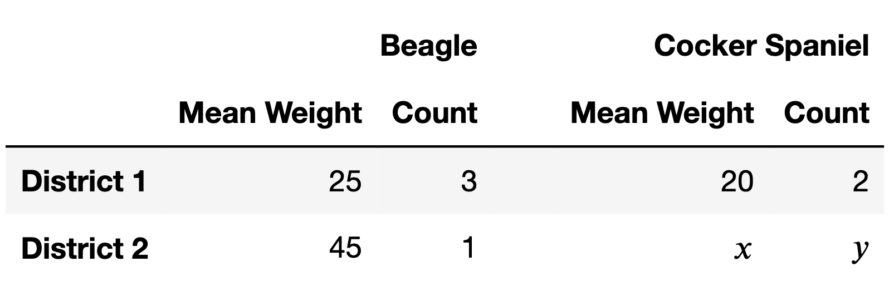

# BEGIN PROB

Jasmine is a veterinarian. Below, you'll find information about some of
the dogs in her care, separated by district and breed.

# BEGIN SUBPROB

What is the mean weight of all beagles in the table above, across both
districts? Give your answer as a positive integer.

# BEGIN SOLUTION

**Answer**: $30$

This is a weighted mean:

$$\frac{25 \cdot 3 + 45 \cdot 1}{3 + 1} = \frac{120}{4} = 30$$

<average>91</average>

# END SOLUTION

# END SUBPROB

# BEGIN SUBPROB

Notice that the table above has two unknowns, $x$ and $y$. Find
**positive integers** $x$ and $y$ such that the mean weight of all
beagles is equal to the mean weight of all cocker spaniels, where $x$ is
as small as possible.

# BEGIN SOLUTION

**Answer**: $x = 31, y = 20$

The mean weight for all beagles is 30. Since the mean weight for cocker spaniels in District 1 is below 30 (it's 20), the mean weight for cocker spaniels in District 2 needs to be above 30 so that it's possible for the mean weight for all cocker spaniels to match the mean weight of all beagles. The smallest $x$ that allows us to match the mean weight, then, is the smallest integer greater than 30, which is 31.

Once we establish that we're going to use $x = 31$, this becomes an algebra problem.

$$\begin{align*}\frac{20 \cdot 2 + 31y}{2 + y} &= 30 \\
\implies 40 + 31y &= 60 + 30y \\ \implies y &= 20 \end{align*}$$

<average>51</average>

# END SOLUTION

# END SUBPROB

# BEGIN SUBPROB

There are two possible ways in which Simpson's paradox could appear in
the table above:

-   Way 1: In each district, the mean weight of beagles is greater than
    the mean weight of cocker spaniels, but overall, the mean weight of
    all beagles is less than the mean weight of all cocker spaniels.
-   Way 2: For each breed, the mean weight of dogs in District 2 is
    greater than the mean weight of dogs in District 1, but overall, the
    mean weight of all dogs in District 2 is less than the mean weight
    of all dogs in District 1.

Is it possible to pick **positive integer** values of $x$ and $y$ such
that both ways of Simpson's paradox mentioned above occur at the same
time?

( ) Yes, it's possible.
( ) No, it's not possible.

# BEGIN SOLUTION

**Answer**: No, it's not possible.

In the first part, we already established that we need $x \geq 31$ in order for the mean weight of all cocker spaniels to be greater than the mean weight of all beagles. But if $x = 31$, then the mean weight of all district 2 dogs has to be somewhere between 31 and 45, which no matter what, is going to be bigger than the mean weight of all district 1 dogs, which is 23. This means that we can't have Simpson's paradox both ways.

<average>59</average>

# END SOLUTION

# END SUBPROB

# END PROB