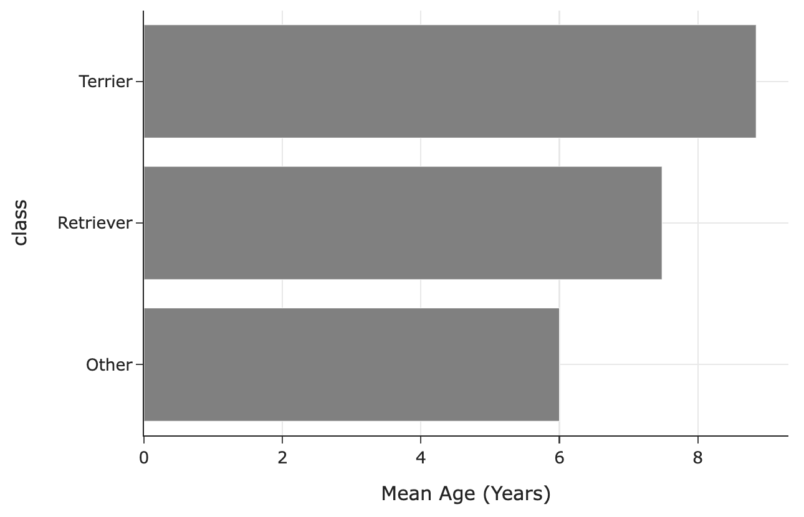

# BEGIN PROB

# BEGIN SUBPROB

What is the most likely missingness mechanism of the `"secondary_breed"`
column in `dogs`?

( ) Missing by design
( ) Not missing at random
( ) Missing at random
( ) Missing completely at random

# BEGIN SOLUTION

**Answer**: Anything other than MCAR

The original answer we had in mind was missing by design. Secondary breeds are missing for purebred dogs – that is, dogs that don't have a secondary breed. There is nothing you could "fill in" here.

However, you can make reasonable arguments for both MAR and NMAR, so we'll give those answers full credit too. For instance, one could argue that certain breeds are less likely to be mixed with other breeds, so the missingness is dependent on primary breed.

# END SOLUTION

# END SUBPROB

Using the `"birth_years"` column in `dogs`, Yutian computes the age of
each dog and stores it in the `"age"` column of `dogs`. She also
categorizes dogs into three "breed classes\" based on their primary
breed – `"Retriever"`, `"Terrier"`, or `"Other"` – and stores these
in the `"class"` column of `dogs`.

The following bar chart shows the distribution of breed classes by
missingness of age:

<center></center>

The following bar chart shows the mean observed
age for each breed class:

<center></center>

# BEGIN SUBPROB

What is the most likely missingness mechanism of ages?

( ) Missing by design
( ) Not missing at random
( ) Missing at random
( ) Missing completely at random

# BEGIN SOLUTION

**Answer**: Missing at random

The distributions of breed classes look quite different when age is missing vs. when age is not missing. Hence, the missingness of ages likely depends on breed classes.

# END SOLUTION

# END SUBPROB

# BEGIN SUBPROB

Name a test statistic we could use to perform a statistical test to
assess whether the missingness of ages depends on breed classes.

# BEGIN SOLUTION

**Answer**: Total variation distance

Breed class is a categorical variable, and hence its distribution is categorical. The tool we have for comparing categorical distributions (in this case, the distribution of breed class when age is missing vs. the distribution of breed class when age is not missing) is the TVD.

# END SOLUTION

# END SUBPROB

# BEGIN SUBPROB

Let $O$ be the mean of the observed ages in `dogs`, that is, the mean of
the ages that aren't missing. Let $T$ be the true mean of the ages in
`dogs`, that is, the mean we'd compute if none of the ages were missing.

What is the relationship between $O$ and $T$?

( ) $O < T$
( ) $O \approx T$
( ) $O = T$
( ) $O > T$

# BEGIN SOLUTION

**Answer**: $O < T$

In the ages we get to observe (that is, when age is not missing), we have way fewer terrier values than in the ages we don't get to observe. Terriers are older on average than the other breed classes. This means we're missing values that are larger, so when we take the average of the values we have access to, it'll be lower than the true mean.

# END SOLUTION

# END SUBPROB

Consider the following strategy for imputing missing ages.

```py
def fill_missing(dogs):
  return dogs.assign(
    age=dogs.groupby("class")["age"]
            .transform(lambda x: x.fillna(x.value_counts().idxmax()))
  )
```

# BEGIN SUBPROB

In one sentence, describe this imputation strategy.

# BEGIN SOLUTION

**Answer**: This is filling in missing ages in each breed class with the most common observed age in that breed class

# END SOLUTION

# END SUBPROB

# BEGIN SUBPROB

`small_dogs` is a subset of `dogs` shown in its entirety below.

<center></center>

If we call `fill_missing` on `small_dogs`, what values would the four
null values in the `"age"` column of `small_dogs` be replaced with?

- row 2: ___
- row 3: ___
- row 4: ___
- row 7: ___

# BEGIN SOLUTION

**Answer**:

- row 2: 5. The most common observed age for the `"Other"` breed class is 5.
- row 3: 5. The most common observed age for the `"Other"` breed class is 5.
- row 4: 12. The most common observed age for the `"Terrier"` breed class is 12.
- row 7: 7. The most common observed age for the `"Retriever"` breed class is 7.


# END SOLUTION

# END SUBPROB

# END PROB