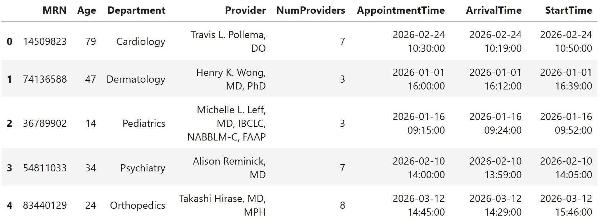

In this exam, you will work with a dataset of medical appointments at UC San Diego Health, to try to predict the amount of time patients had to wait for their appointments to start.

In the DataFrame `med`, each row represents a single medical appointment attended by a patient (no-shows are not included). The columns are:

- `"MRN"` (`str`): Medical record number, a unique identifier for the patient within the UC San Diego Health system.
- `"Age"` (`int`): The age of the patient.
- `"Department"` (`str`): The medical department where the appointment took place.
- `"Provider"` (`str`): The medical provider (doctor, or similar) for the appointment.
- `"NumProviders"` (`int`): The number of medical providers working in that department at the time of the appointment.
- `"AppointmentTime"` (`pd.Timestamp`): The time at which the appointment was scheduled to begin, using a 24-hour clock. Ends in one of `:00:00`, `:15:00`, `:30:00`, `:45:00`.
- `"ArrivalTime"` (`pd.Timestamp`): The time at which the patient arrived, to the nearest minute. Patients may arrive before or after their scheduled appointment time.
- `"StartTime"` (`pd.Timestamp`): The time at which the appointment actually began, to the nearest minute. The start time is always at or after the arrival time and the scheduled appointment time.

There are no missing values in `med`. The first five rows of `med` are shown below, though `med` has many more.

Throughout the exam, assume that we have already run the necessary import statements.
