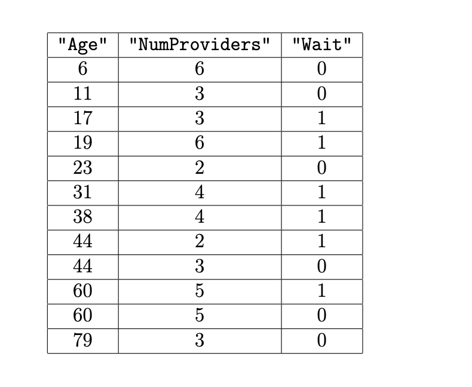

# BEGIN PROB

Consider the small subset of `med` shown in full below. Recall that the `"Wait"` column was added after Question 1. The data is sorted by `"Age"`.

# BEGIN SUBPROB

If we train a decision tree on this data to predict `"Wait"` based on `"Age"` and `"NumProviders"`, what is the maximum possible accuracy the decision tree could achieve? Give your answer as an exact decimal or simplified fraction.

# BEGIN SOLUTION

**Answer:** $\frac{11}{12}$

There are 12 rows in the dataset. A decision tree can achieve perfect classification on 11 of them, but at least one row cannot be separated from the rest using only `"Age"` and `"NumProviders"`. So the best possible accuracy is $\frac{11}{12}$.

# END SOLUTION

# END SUBPROB

# BEGIN SUBPROB

Select the expression below that gives the weighted entropy associated with using `"Age" >= 15` as the root node of the decision tree.

( ) $\frac{1}{6}\left(-\frac{2}{5}\log_2\frac{2}{5} - \frac{3}{5}\log_2\frac{3}{5}\right)$
( ) $-\frac{2}{5}\log_2\frac{2}{5} - \frac{3}{5}\log_2\frac{3}{5}$
( ) $\frac{1}{6}\left(-\frac{1}{2}\log_2\frac{1}{2} - \frac{1}{2}\log_2\frac{1}{2}\right)$
( ) $-\frac{1}{2}\log_2\frac{1}{2} - \frac{1}{2}\log_2\frac{1}{2}$
( ) $\frac{5}{6}\left(-\frac{2}{5}\log_2\frac{2}{5} - \frac{3}{5}\log_2\frac{3}{5}\right)$

# BEGIN SOLUTION

**Answer:** $\frac{5}{6}\left(-\frac{2}{5}\log_2\frac{2}{5} - \frac{3}{5}\log_2\frac{3}{5}\right)$

Splitting on `"Age" >= 15` puts 2 rows in the left child (both with `"Wait"` = 0, so entropy 0) and 10 rows in the right child (6 with `"Wait"` = 1 and 4 with `"Wait"` = 0). The weighted entropy is:

$$\frac{2}{12}(0) + \frac{10}{12}\left(-\frac{6}{10}\log_2\frac{6}{10} - \frac{4}{10}\log_2\frac{4}{10}\right) = \frac{5}{6}\left(-\frac{2}{5}\log_2\frac{2}{5} - \frac{3}{5}\log_2\frac{3}{5}\right)$$

The other expressions either use the wrong group sizes or compute unweighted entropy.

# END SOLUTION

# END SUBPROB

# BEGIN SUBPROB

All but one of the following questions splits the data in such a way that the weighted entropy is the same. Which question yields a **different** weighted entropy than the others?

( ) `"NumProviders" <= 2`
( ) `"NumProviders" <= 3`
( ) `"NumProviders" <= 4`
( ) `"NumProviders" <= 5`
( ) `"NumProviders" <= 6`

# BEGIN SOLUTION

**Answer:** `"NumProviders" <= 3`

All of the listed splits except `"NumProviders" <= 3` produce the same weighted entropy of 1. The split at 3 providers gives a different weighted entropy (about 0.918).

# END SOLUTION

# END SUBPROB

# BEGIN SUBPROB

What is the weighted entropy associated with any one of the questions you did **not** pick in part (c)? Give your answer as an exact decimal or simplified fraction.

# BEGIN SOLUTION

**Answer:** $1$

Each of the splits other than `"NumProviders" <= 3` has weighted entropy 1. This happens when each child node is evenly split between the two classes (maximum entropy for binary classification).

# END SOLUTION

# END SUBPROB

# END PROB
