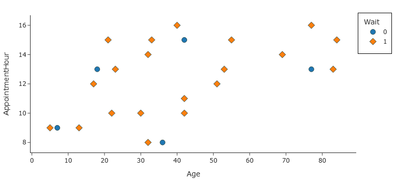
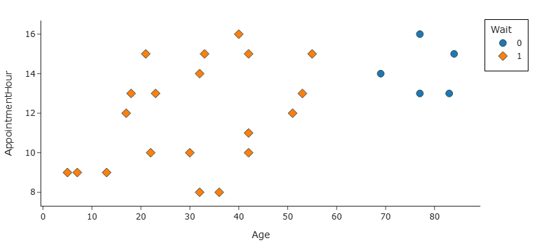

# BEGIN PROB

In Lab 9, you learned about $k$-nearest neighbors regression. A related machine learning algorithm is $k$-nearest neighbors classification, in which predictions are made by finding the $k$ points in the training data that are nearest to the point we are trying to classify. We predict the class that the majority of those $k$ points belong to (similar to the way in which decision trees in a random forest vote on a prediction). In this problem, we'll use the standard Euclidean ($L_2$) distance to measure the distance between points.

In this problem, we'll try to predict `"Wait"` based on `"Age"` and `"AppointmentHour"`, where `"AppointmentHour"` is the hour from the `"AppointmentTime"` column.

# BEGIN SUBPROB

Suppose the training data consists only of the 25 points shown below. Determine the accuracy, precision, and recall of a 3-nearest neighbors classifier on this data.

1. Accuracy:

2. Precision:

3. Recall:

# BEGIN SOLUTION

**Answers:** $0.8$, $0.8$, $1$

There are 20 class-1 points and 5 class-0 points in this dataset. With $k = 3$, every point's 3 nearest neighbors are all class 1, so the classifier predicts class 1 for all 25 points. This gives a confusion matrix of TP = 20, FP = 5, TN = 0, FN = 0.

$$\text{Accuracy} = \frac{20}{25} = \frac{4}{5} = 0.8 \qquad \text{Precision} = \frac{20}{25} = \frac{4}{5} = 0.8 \qquad \text{Recall} = \frac{20}{20} = 1$$

# END SOLUTION

# END SUBPROB

# BEGIN SUBPROB

Now suppose the training data consists only of the 25 points shown below. Determine the accuracy, precision, and recall of a 3-nearest neighbors classifier on this data.

1. Accuracy:

2. Precision:

3. Recall:

# BEGIN SOLUTION

**Answers:** $1$, $1$, $1$

On this dataset, every point is correctly classified by its 3 nearest neighbors, so accuracy, precision, and recall are all 1.

# END SOLUTION

# END SUBPROB

# BEGIN SUBPROB

Finally, consider a 15-nearest neighbor classifier, which has the same accuracy on both datasets. What is that accuracy?

# BEGIN SOLUTION

**Answer:** $0.8$

Both datasets have 20 class-1 points and 5 class-0 points. With $k = 15$ neighbors, the majority is determined by a vote of 15 — but there are only 5 class-0 points in the entire dataset. So no matter which point we classify, at most 5 of the 15 nearest neighbors can be class 0, meaning the majority is always class 1. The classifier therefore predicts class 1 for every point, giving accuracy $\frac{20}{25} = 0.8$ on both scatter plots.

# END SOLUTION

# END SUBPROB

# END PROB
